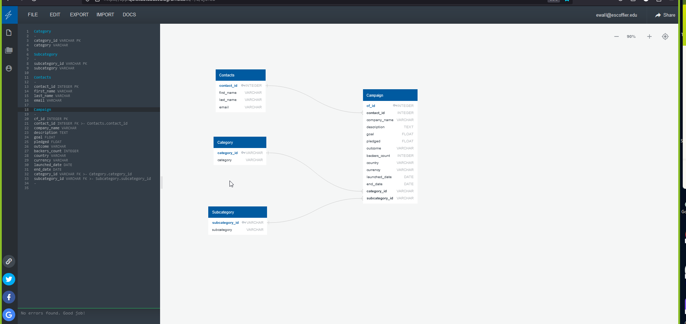

# Crowdfunding_ETL
## Instructions

The instructions for this mini project are divided into the following subsections:

    Create the Category and Subcategory DataFrames
    
   # Create a category DataFrame with the category_id array as the category_id and categories list as the category name.
category_df = pd.DataFrame({'category': categories})
category_df['category_id'] = ['cat' + str(i+1) for i in range(len(cat_ids))]
category_df = category_df[['category_id', 'category']]

# Create a category DataFrame with the subcategory_id array as the subcategory_id and subcategories list as the subcategory name. 
subcategory_df = pd.DataFrame({'subcategory': subcategories})
subcategory_df['subcategory_id'] = ['subcat' + str(i+1) for i in range(len(scat_ids))]
subcategory_df = subcategory_df[['subcategory_id', 'subcategory']]

category_df
    
    Create the Campaign DataFrame
# Create a copy of the crowdfunding_info_df DataFrame name campaign_df. 
campaign_df = crowdfunding_info_df.copy()
campaign_df.head()
    
    Create the Contacts DataFrame
# Read the data into a Pandas DataFrame. Use the `header=2` parameter when reading in the data.
contact_info_df = pd.read_excel('Resources/contacts.xlsx', header=3)
contact_info_df_copy = contact_info_df.copy()
contact_info_df.head()

    
    Create the Crowdfunding Database
# Read the data into a Pandas DataFrame
crowdfunding_info_df = pd.read_excel('Resources/crowdfunding.xlsx')
crowdfunding_info_df.head()

 # Get a brief summary of the crowdfunding_info Dataframe
crowdfunding_info_df.info()   

### Create the Category and Subcategory DataFrames

    Extract and transform the crowdfunding.xlsx Excel data to create a category DataFrame that has the following columns:

        A "category_id" column that has entries going sequentially from "cat1" to "catn", where n is the number of unique categories

        A "category" column that contains only the category titles

        Export the category DataFrame as category.csv and save it to your GitHub repository. 

# Export categories_df and subcategories_df as CSV files.
category_df.to_csv("Resources/category.csv", index=False)

subcategory_df.to_csv("Resources/subcategory.csv", index=False)
           
 
	A "category_id" column that has entries going sequentially from "cat1" to "catn", where n is the number of unique categories  
# Get the unique categories and subcategories in separate lists.
categories = crowdfunding_info_df['category'].unique().tolist()
subcategories = crowdfunding_info_df['subcategory'].unique().tolist()

print(categories)
print(subcategories)

print(categories)
print(subcategories)

 

   # Get the crowdfunding_info_df columns.

     crowdfunding_info_df.columns     
        
       
        
A "category" column that contains only the category titles

 # Assign the category and subcategory values to category and subcategory columns.

   crowdfunding_info_df[['category', 'subcategory']] = crowdfunding_info_df['category & sub-category'].str.split('/',     expand=True)

  crowdfunding_info_df.head()

        # Get the unique categories and subcategories in separate lists.
categories = crowdfunding_info_df['category'].unique().tolist()
subcategories = crowdfunding_info_df['subcategory'].unique().tolist()

print(categories)

    Export the category DataFrame as category.csv and save it to your GitHub repository.

# Export categories_df and subcategories_df as CSV files.

   category_df.to_csv("Resources/category.csv", index=False)

   subcategory_df.to_csv("Resources/subcategory.csv", index=False)

    Extract and transform the crowdfunding.xlsx Excel data to create a subcategory DataFrame that has the following columns:

        A "subcategory_id" column that has entries going sequentially from "subcat1" to "subcatn", where n is the number of unique subcategories

# Create a category DataFrame with the category_id array as the category_id and categories list as the category name.
category_df = pd.DataFrame({'category': categories})
category_df['category_id'] = ['cat' + str(i+1) for i in range(len(cat_ids))]
category_df = category_df[['category_id', 'category']] 

# Create a category DataFrame with the subcategory_id array as the subcategory_id and subcategories list as the subcategory name. 
subcategory_df = pd.DataFrame({'subcategory': subcategories})
subcategory_df['subcategory_id'] = ['subcat' + str(i+1) for i in range(len(scat_ids))]
subcategory_df = subcategory_df[['subcategory_id', 'subcategory']]

category_df 

	category_id	category
0	cat1	food
1	cat2	music
2	cat3	technology
3	cat4	theater
4	cat5	film & video
5	cat6	publishing
6	cat7	games
7	cat8	photography
8	cat9	journalism

        A "subcategory" column that contains only the subcategory titles

subcategory_df 

	subcategory_id	subcategory
0	subcat1	food trucks
1	subcat2	rock
2	subcat3	web
3	subcat4	plays
4	subcat5	documentary
5	subcat6	electric music
6	subcat7	drama
7	subcat8	indie rock
8	subcat9	wearables
9	subcat10	nonfiction
10	subcat11	animation
11	subcat12	video games
12	subcat13	shorts
13	subcat14	fiction
14	subcat15	photography books
15	subcat16	radio & podcasts
16	subcat17	metal
17	subcat18	jazz
18	subcat19	translations
19	subcat20	television
20	subcat21	mobile games
21	subcat22	world music
22	subcat23	science fiction
23	subcat24	audio

    Export the subcategory DataFrame as subcategory.csv and save it to your GitHub repository.  

# Export categories_df and subcategories_df as CSV files.
category_df.to_csv("Resources/category.csv", index=False)

subcategory_df.to_csv("Resources/subcategory.csv", index=False)
    

### Create the Contacts DataFrame

    Choose one of the following two options for extracting and transforming the data from the contacts.xlsx Excel data:

        Option 1: Use Python dictionary methods.

       complete the following steps:
        
    Import the contacts.xlsx file into a DataFrame.
    
  # Read the data into a Pandas DataFrame
crowdfunding_info_df = pd.read_excel('Resources/crowdfunding.xlsx')
crowdfunding_info_df.head()    

# Get a brief summary of the crowdfunding_info Dataframe
crowdfunding_info_df.info() 

	Iterate through the DataFrame, converting each row to a dictionary. 
# Iterate through the DataFrame and convert each row to a dictionary
dict_values = [json.loads(row) for row in contact_info_df['contact_info']]

    # Iterate through the contact_info_df and convert each row to a dictionary.
# Iterate through the contact_info_df and convert each row to a dictionary.
import json
dict_values = []

# Iterate through the DataFrame and convert each row to a dictionary
dict_values = [json.loads(row) for row in contact_info_df['contact_info']]

# Print out the list of values for each row.
print(dict_values[0:10])
# Print out the list of values for each row.
print(dict_values)
 
        
	Iterate through each dictionary, doing the following:
            Extract the dictionary values from the keys by using a Python list comprehension.
             Add the values for each row to a new list.
        
	Create a new DataFrame that contains the extracted data.

 # Create a contact_info DataFrame and add each list of values, i.e., each row 
# to the 'contact_id', 'name', 'email' columns.
contact_info_df = pd.DataFrame(dict_values, columns=['contact_id', 'name', 'email'])

contact_info_df.head(10)  

# Check the datatypes.
contact_info_df.info()

 
        Split each "name" column value into a first and last name, and place each in a new column.
# Assign the category and subcategory values to category and subcategory columns.
crowdfunding_info_df[['category', 'subcategory']] = crowdfunding_info_df['category & sub-category'].str.split('/', expand=True)

crowdfunding_info_df.head()  

    Clean and export the DataFrame as contacts.csv and save it to your GitHub repository.
# Export the DataFrame as a CSV file. 
campaign_cleaned.to_csv("Resources/campaign.csv", index=False) 

# Iterate through the contact_info_df and convert each row to a dictionary.
import json
dict_values = []

# Iterate through the DataFrame and convert each row to a dictionary
dict_values = [json.loads(row) for row in contact_info_df['contact_info']]

# Print out the list of values for each row.
print(dict_values[0:10])
# Print out the list of values for each row.
print(dict_values)

### Check that your final DataFrame resembles the one in the following image:

### Create the Crowdfunding Database

    Inspect the four CSV files, and then sketch an ERD of the tables by using QuickDBD 

Links to an external site..

Use the information from the ERD to create a table schema for each CSV file.

Note: Remember to specify the data types, primary keys, foreign keys, and other constraints.

Save the database schema as a Postgres file named crowdfunding_db_schema.sql, and save it to your GitHub repository.

https://github.com/Ewall24/Crowdfunding_ETL/blob/main/Crowdfunding_DB_Schema.sql

Create a new Postgres database, named crowdfunding_db.

Using the database schema, create the tables in the correct order to handle the foreign keys.
Import each CSV file into its corresponding SQL table.
Verify that each table has the correct data by running a SELECT statement for each.

CREATE TABLE "category" (
    "category_id" VARCHAR(50) NOT NULL,
    "category" VARCHAR(50) NOT NULL,
    CONSTRAINT "pk_category" PRIMARY KEY ("category_id")
);
CREATE TABLE "subcategory" (
    "subcategory_id" VARCHAR(50) NOT NULL,
    "subcategory" VARCHAR(50) NOT NULL,
    CONSTRAINT "pk_subcategory" PRIMARY KEY ("subcategory_id")
);
CREATE TABLE "contacts" (
    "contact_id" INT NOT NULL,
    "first_name" VARCHAR(50) NOT NULL,
    "last_name" VARCHAR(50) NOT NULL,
    "email" VARCHAR(50) NOT NULL,
    CONSTRAINT "pk_contacts" PRIMARY KEY ("contact_id")
);
CREATE TABLE "campaign" (
    "cf_id" INT NOT NULL,
    "contact_id" INT NOT NULL,
    "company_name" VARCHAR(50) NOT NULL,
    "description" TEXT NOT NULL,
    "goal" FLOAT NOT NULL,
    "pledged" FLOAT NOT NULL,
    "outcome" VARCHAR(50) NOT NULL,
    "backers_count" INT NOT NULL,
    "country" VARCHAR(50) NOT NULL,
    "currency" VARCHAR(50) NOT NULL,
    "launched_date" DATE NOT NULL,
    "end_date" DATE NOT NULL,
    "category_id" VARCHAR(50) NOT NULL,
    "subcategory_id" VARCHAR(50) NOT NULL,
    CONSTRAINT "pk_campaign" PRIMARY KEY ("cf_id")
);

Verify the table creation by running a SELECT statement for each table. 

DROP TABLE IF EXISTS category;
CREATE TABLE category(
    category_id VARCHAR(50) PRIMARY KEY,
    category VARCHAR(50) NOT NULL
);
SELECT *
FROM category;  

DROP TABLE IF EXISTS subcategory;
CREATE TABLE subcategory(
    subcategory_id VARCHAR(50) PRIMARY KEY,
    subcategory VARCHAR(50) NOT NULL
);
SELECT *
FROM subcategory;  

DROP TABLE IF EXISTS contacts;
CREATE TABLE contacts(
    contact_id INT PRIMARY KEY,
    first_name VARCHAR(50) NOT NULL,
    last_name VARCHAR(50) NOT NULL,
    email VARCHAR(50) NOT NULL
);
SELECT *
FROM contacts; 

DROP TABLE IF EXISTS campaign;
CREATE TABLE campaign(
    cf_id INT PRIMARY KEY,
    contact_id INT NOT NULL,
    company_name VARCHAR(50) NOT NULL,
    description TEXT NOT NULL,
    goal FLOAT NOT NULL,
    pledged FLOAT NOT NULL,
    outcome VARCHAR(50) NOT NULL,
    backers_count INT NOT NULL,
    country VARCHAR(50) NOT NULL,
    currency VARCHAR(50) NOT NULL,
    launched_date DATE NOT NULL,
    end_date DATE NOT NULL,
    category_id VARCHAR(50) NOT NULL,
    subcategory_id VARCHAR(50) NOT NULL
);
SELECT *
FROM campaign; 

## Collaboration  
Omid Khan - omidk414@gmail.com - omidk414  
Gursimran Kaur - kaursimran081999@gmail.com - SimranBoparai 
Rinal Shastri - 

